# Stagecraft Features Overview

This document is auto-generated from `spec/features.yaml` and spec file frontmatter.
Do not edit this file manually. Regenerate with:

```bash
go run ./cmd/gen-features-overview
```

## Features by Domain

| ID | Domain | Status | Title | Dependencies |
|----|--------|--------|-------|---------------|
| DOCS_ADR | adr | todo | ADR process and initial decisions | - |
| CLI_ATTACH | commands | todo | stagecraft attach for existing projects | - |
| CLI_BUILD | commands | done | stagecraft build command | - |
| CLI_CI_INIT | commands | todo | stagecraft ci init command | - |
| CLI_CI_RUN | commands | todo | stagecraft ci run command | - |
| CLI_COMMIT_SUGGEST | commands | done | stagecraft commit suggest command | GOV_CORE |
| CLI_DEPLOY | commands | done | Deploy command | - |
| CLI_DEV | commands | done | stagecraft dev command (full feature set) | - |
| CLI_DEV_BASIC | commands | done | Basic stagecraft dev command that delegates to backend provider | - |
| CLI_INFRA_DOWN | commands | todo | stagecraft infra down command | - |
| CLI_INFRA_UP | commands | done | stagecraft infra up command | - |
| CLI_INIT | commands | done | Project bootstrap command | - |
| CLI_LOGS | commands | todo | stagecraft logs command | - |
| CLI_MIGRATE_BASIC | commands | done | Basic stagecraft migrate command using registered migration engines | - |
| CLI_MIGRATE_PLAN | commands | todo | stagecraft migrate plan command (dedicated) | - |
| CLI_MIGRATE_RUN | commands | todo | stagecraft migrate run command (dedicated) | - |
| CLI_NEW | commands | todo | stagecraft new --template=platform | - |
| CLI_PLAN | commands | done | Plan command (dry-run) | CORE_PLAN, CORE_CONFIG, CLI_DEPLOY, CLI_BUILD |
| CLI_RELEASES | commands | done | stagecraft releases list/show commands | - |
| CLI_ROLLBACK | commands | done | stagecraft rollback command | - |
| CLI_SECRETS_SYNC | commands | todo | stagecraft secrets sync command | - |
| CLI_SSH | commands | todo | stagecraft ssh command | - |
| CLI_STATUS | commands | todo | stagecraft status command | - |
| GOV_STATUS_ROADMAP | commands | done | stagecraft status roadmap command | GOV_CORE |
| CLI_GLOBAL_FLAGS | core | done | Global flags (--env, --config, --verbose, --dry-run) | - |
| CLI_PHASE_EXECUTION_COMMON | core | done | Shared phase execution semantics for deploy and rollback | - |
| CORE_BACKEND_PROVIDER_CONFIG_SCHEMA | core | done | Provider-scoped backend configuration schema | - |
| CORE_BACKEND_REGISTRY | core | done | Backend provider registry system | - |
| CORE_COMPOSE | core | done | Docker Compose integration | - |
| CORE_CONFIG | core | done | Config loading and validation | - |
| CORE_ENV_RESOLUTION | core | done | Environment resolution and context | - |
| CORE_EXECUTIL | core | done | Process execution utilities | - |
| CORE_LOGGING | core | done | Structured logging helpers | - |
| CORE_MIGRATION_REGISTRY | core | done | Migration engine registry system | - |
| CORE_PLAN | core | done | Deployment planning engine | - |
| CORE_STATE | core | done | State management (release history) | - |
| CORE_STATE_CONSISTENCY | core | done | State durability and read-after-write guarantees | - |
| CORE_STATE_TEST_ISOLATION | core | done | State test isolation for CLI commands | - |
| PROVIDER_BACKEND_INTERFACE | core | done | BackendProvider interface definition | - |
| DEPLOY_COMPOSE_GEN | deploy | done | Per-host Compose generation | - |
| DEPLOY_ROLLOUT | deploy | done | docker-rollout integration | - |
| DEV_COMPOSE_INFRA | dev | done | Compose infra up/down for dev | - |
| DEV_HOSTS | dev | done | /etc/hosts management | - |
| DEV_MKCERT | dev | done | mkcert integration for local HTTPS | - |
| DEV_PROCESS_MGMT | dev | done | Process lifecycle management | - |
| DEV_TRAEFIK | dev | done | Traefik dev config generation | - |
| ENGINE_PLAN_ACTIONS | engine | draft | Engine Plan Actions and Inputs Schema | CORE_PLAN |
| GOV_CLI_EXIT_CODES | governance | todo | CLI exit code governance and standardization | GOV_CORE |
| GOV_CORE | governance | done | Governance Core for v1 | CORE_STATE, CLI_PHASE_EXECUTION_COMMON |
| INFRA_FIREWALL | infra | todo | Firewall configuration | - |
| INFRA_HOST_BOOTSTRAP | infra | done | Host bootstrap (Docker, Tailscale, etc.) | - |
| INFRA_VOLUME_MGMT | infra | todo | Volume management | - |
| MIGRATION_CONFIG | migrations | done | Migration config schema in stagecraft.yml | - |
| MIGRATION_CONTAINER_RUNNER | migrations | todo | ContainerRunner interface | - |
| MIGRATION_INTERFACE | migrations | done | Migrator interface | - |
| MIGRATION_POST_DEPLOY | migrations | todo | Post-deploy migration execution | - |
| MIGRATION_PRE_DEPLOY | migrations | todo | Pre-deploy migration execution | - |
| ARCH_OVERVIEW | overview | todo | Architecture documentation and project overview | - |
| MIGRATION_ENGINE_RAW | providers | done | Raw SQL migration engine implementation | - |
| PROVIDER_BACKEND_ENCORE | providers | done | Encore.ts BackendProvider implementation | - |
| PROVIDER_BACKEND_GENERIC | providers | done | Generic command-based BackendProvider implementation | - |
| PROVIDER_CI_GITHUB | providers | todo | GitHub Actions CIProvider | - |
| PROVIDER_CI_INTERFACE | providers | done | CIProvider interface definition | - |
| PROVIDER_CLOUD_DO | providers | done | DigitalOcean CloudProvider implementation | - |
| PROVIDER_CLOUD_INTERFACE | providers | done | CloudProvider interface definition | - |
| PROVIDER_FRONTEND_GENERIC | providers | done | Generic dev command FrontendProvider | - |
| PROVIDER_FRONTEND_INTERFACE | providers | done | FrontendProvider interface definition | - |
| PROVIDER_NETWORK_INTERFACE | providers | done | NetworkProvider interface definition | - |
| PROVIDER_NETWORK_TAILSCALE | providers | done | Tailscale NetworkProvider implementation | - |
| PROVIDER_SECRETS_ENCORE | providers | todo | Encore dev secrets SecretsProvider | - |
| PROVIDER_SECRETS_ENVFILE | providers | todo | Env file SecretsProvider | - |
| PROVIDER_SECRETS_INTERFACE | providers | done | SecretsProvider interface definition | - |
| CLI_INIT_TEMPLATE | scaffold | todo | Template system for stagecraft init | - |
| SCAFFOLD_STAGECRAFT_DIR | scaffold | todo | .stagecraft/ directory generation | - |
| TEMPLATE_PLATFORM | scaffold | todo | Platform template (embedded) | - |
| DRIVER_DO | unknown | cancelled | DigitalOcean driver | - |

## Dependency Graph

The following DOT graph shows feature dependencies:

```dot
digraph feature_dependencies {
  rankdir=LR;
  node [shape=box];

  "ARCH_OVERVIEW" [label="ARCH_OVERVIEW\\n[todo]" fillcolor="lightgray" style=filled];
  "CLI_ATTACH" [label="CLI_ATTACH\\n[todo]" fillcolor="lightgray" style=filled];
  "CLI_BUILD" [label="CLI_BUILD\\n[done]" fillcolor="lightgreen" style=filled];
  "CLI_CI_INIT" [label="CLI_CI_INIT\\n[todo]" fillcolor="lightgray" style=filled];
  "CLI_CI_RUN" [label="CLI_CI_RUN\\n[todo]" fillcolor="lightgray" style=filled];
  "CLI_COMMIT_SUGGEST" [label="CLI_COMMIT_SUGGEST\\n[done]" fillcolor="lightgreen" style=filled];
  "CLI_DEPLOY" [label="CLI_DEPLOY\\n[done]" fillcolor="lightgreen" style=filled];
  "CLI_DEV" [label="CLI_DEV\\n[done]" fillcolor="lightgreen" style=filled];
  "CLI_DEV_BASIC" [label="CLI_DEV_BASIC\\n[done]" fillcolor="lightgreen" style=filled];
  "CLI_GLOBAL_FLAGS" [label="CLI_GLOBAL_FLAGS\\n[done]" fillcolor="lightgreen" style=filled];
  "CLI_INFRA_DOWN" [label="CLI_INFRA_DOWN\\n[todo]" fillcolor="lightgray" style=filled];
  "CLI_INFRA_UP" [label="CLI_INFRA_UP\\n[done]" fillcolor="lightgreen" style=filled];
  "CLI_INIT" [label="CLI_INIT\\n[done]" fillcolor="lightgreen" style=filled];
  "CLI_INIT_TEMPLATE" [label="CLI_INIT_TEMPLATE\\n[todo]" fillcolor="lightgray" style=filled];
  "CLI_LOGS" [label="CLI_LOGS\\n[todo]" fillcolor="lightgray" style=filled];
  "CLI_MIGRATE_BASIC" [label="CLI_MIGRATE_BASIC\\n[done]" fillcolor="lightgreen" style=filled];
  "CLI_MIGRATE_PLAN" [label="CLI_MIGRATE_PLAN\\n[todo]" fillcolor="lightgray" style=filled];
  "CLI_MIGRATE_RUN" [label="CLI_MIGRATE_RUN\\n[todo]" fillcolor="lightgray" style=filled];
  "CLI_NEW" [label="CLI_NEW\\n[todo]" fillcolor="lightgray" style=filled];
  "CLI_PHASE_EXECUTION_COMMON" [label="CLI_PHASE_EXECUTION_COMMON\\n[done]" fillcolor="lightgreen" style=filled];
  "CLI_PLAN" [label="CLI_PLAN\\n[done]" fillcolor="lightgreen" style=filled];
  "CLI_RELEASES" [label="CLI_RELEASES\\n[done]" fillcolor="lightgreen" style=filled];
  "CLI_ROLLBACK" [label="CLI_ROLLBACK\\n[done]" fillcolor="lightgreen" style=filled];
  "CLI_SECRETS_SYNC" [label="CLI_SECRETS_SYNC\\n[todo]" fillcolor="lightgray" style=filled];
  "CLI_SSH" [label="CLI_SSH\\n[todo]" fillcolor="lightgray" style=filled];
  "CLI_STATUS" [label="CLI_STATUS\\n[todo]" fillcolor="lightgray" style=filled];
  "CORE_BACKEND_PROVIDER_CONFIG_SCHEMA" [label="CORE_BACKEND_PROVIDER_CONFIG_SCHEMA\\n[done]" fillcolor="lightgreen" style=filled];
  "CORE_BACKEND_REGISTRY" [label="CORE_BACKEND_REGISTRY\\n[done]" fillcolor="lightgreen" style=filled];
  "CORE_COMPOSE" [label="CORE_COMPOSE\\n[done]" fillcolor="lightgreen" style=filled];
  "CORE_CONFIG" [label="CORE_CONFIG\\n[done]" fillcolor="lightgreen" style=filled];
  "CORE_ENV_RESOLUTION" [label="CORE_ENV_RESOLUTION\\n[done]" fillcolor="lightgreen" style=filled];
  "CORE_EXECUTIL" [label="CORE_EXECUTIL\\n[done]" fillcolor="lightgreen" style=filled];
  "CORE_LOGGING" [label="CORE_LOGGING\\n[done]" fillcolor="lightgreen" style=filled];
  "CORE_MIGRATION_REGISTRY" [label="CORE_MIGRATION_REGISTRY\\n[done]" fillcolor="lightgreen" style=filled];
  "CORE_PLAN" [label="CORE_PLAN\\n[done]" fillcolor="lightgreen" style=filled];
  "CORE_STATE" [label="CORE_STATE\\n[done]" fillcolor="lightgreen" style=filled];
  "CORE_STATE_CONSISTENCY" [label="CORE_STATE_CONSISTENCY\\n[done]" fillcolor="lightgreen" style=filled];
  "CORE_STATE_TEST_ISOLATION" [label="CORE_STATE_TEST_ISOLATION\\n[done]" fillcolor="lightgreen" style=filled];
  "DEPLOY_COMPOSE_GEN" [label="DEPLOY_COMPOSE_GEN\\n[done]" fillcolor="lightgreen" style=filled];
  "DEPLOY_ROLLOUT" [label="DEPLOY_ROLLOUT\\n[done]" fillcolor="lightgreen" style=filled];
  "DEV_COMPOSE_INFRA" [label="DEV_COMPOSE_INFRA\\n[done]" fillcolor="lightgreen" style=filled];
  "DEV_HOSTS" [label="DEV_HOSTS\\n[done]" fillcolor="lightgreen" style=filled];
  "DEV_MKCERT" [label="DEV_MKCERT\\n[done]" fillcolor="lightgreen" style=filled];
  "DEV_PROCESS_MGMT" [label="DEV_PROCESS_MGMT\\n[done]" fillcolor="lightgreen" style=filled];
  "DEV_TRAEFIK" [label="DEV_TRAEFIK\\n[done]" fillcolor="lightgreen" style=filled];
  "DOCS_ADR" [label="DOCS_ADR\\n[todo]" fillcolor="lightgray" style=filled];
  "DRIVER_DO" [label="DRIVER_DO\\n[cancelled]" fillcolor="white" style=filled];
  "ENGINE_PLAN_ACTIONS" [label="ENGINE_PLAN_ACTIONS\\n[draft]" fillcolor="white" style=filled];
  "GOV_CLI_EXIT_CODES" [label="GOV_CLI_EXIT_CODES\\n[todo]" fillcolor="lightgray" style=filled];
  "GOV_STATUS_ROADMAP" [label="GOV_STATUS_ROADMAP\\n[done]" fillcolor="lightgreen" style=filled];
  "GOV_CORE" [label="GOV_CORE\\n[done]" fillcolor="lightgreen" style=filled];
  "INFRA_FIREWALL" [label="INFRA_FIREWALL\\n[todo]" fillcolor="lightgray" style=filled];
  "INFRA_HOST_BOOTSTRAP" [label="INFRA_HOST_BOOTSTRAP\\n[done]" fillcolor="lightgreen" style=filled];
  "INFRA_VOLUME_MGMT" [label="INFRA_VOLUME_MGMT\\n[todo]" fillcolor="lightgray" style=filled];
  "MIGRATION_CONFIG" [label="MIGRATION_CONFIG\\n[done]" fillcolor="lightgreen" style=filled];
  "MIGRATION_CONTAINER_RUNNER" [label="MIGRATION_CONTAINER_RUNNER\\n[todo]" fillcolor="lightgray" style=filled];
  "MIGRATION_ENGINE_RAW" [label="MIGRATION_ENGINE_RAW\\n[done]" fillcolor="lightgreen" style=filled];
  "MIGRATION_INTERFACE" [label="MIGRATION_INTERFACE\\n[done]" fillcolor="lightgreen" style=filled];
  "MIGRATION_POST_DEPLOY" [label="MIGRATION_POST_DEPLOY\\n[todo]" fillcolor="lightgray" style=filled];
  "MIGRATION_PRE_DEPLOY" [label="MIGRATION_PRE_DEPLOY\\n[todo]" fillcolor="lightgray" style=filled];
  "PROVIDER_BACKEND_ENCORE" [label="PROVIDER_BACKEND_ENCORE\\n[done]" fillcolor="lightgreen" style=filled];
  "PROVIDER_BACKEND_GENERIC" [label="PROVIDER_BACKEND_GENERIC\\n[done]" fillcolor="lightgreen" style=filled];
  "PROVIDER_BACKEND_INTERFACE" [label="PROVIDER_BACKEND_INTERFACE\\n[done]" fillcolor="lightgreen" style=filled];
  "PROVIDER_CI_GITHUB" [label="PROVIDER_CI_GITHUB\\n[todo]" fillcolor="lightgray" style=filled];
  "PROVIDER_CI_INTERFACE" [label="PROVIDER_CI_INTERFACE\\n[done]" fillcolor="lightgreen" style=filled];
  "PROVIDER_CLOUD_DO" [label="PROVIDER_CLOUD_DO\\n[done]" fillcolor="lightgreen" style=filled];
  "PROVIDER_CLOUD_INTERFACE" [label="PROVIDER_CLOUD_INTERFACE\\n[done]" fillcolor="lightgreen" style=filled];
  "PROVIDER_FRONTEND_GENERIC" [label="PROVIDER_FRONTEND_GENERIC\\n[done]" fillcolor="lightgreen" style=filled];
  "PROVIDER_FRONTEND_INTERFACE" [label="PROVIDER_FRONTEND_INTERFACE\\n[done]" fillcolor="lightgreen" style=filled];
  "PROVIDER_NETWORK_INTERFACE" [label="PROVIDER_NETWORK_INTERFACE\\n[done]" fillcolor="lightgreen" style=filled];
  "PROVIDER_NETWORK_TAILSCALE" [label="PROVIDER_NETWORK_TAILSCALE\\n[done]" fillcolor="lightgreen" style=filled];
  "PROVIDER_SECRETS_ENCORE" [label="PROVIDER_SECRETS_ENCORE\\n[todo]" fillcolor="lightgray" style=filled];
  "PROVIDER_SECRETS_ENVFILE" [label="PROVIDER_SECRETS_ENVFILE\\n[todo]" fillcolor="lightgray" style=filled];
  "PROVIDER_SECRETS_INTERFACE" [label="PROVIDER_SECRETS_INTERFACE\\n[done]" fillcolor="lightgreen" style=filled];
  "SCAFFOLD_STAGECRAFT_DIR" [label="SCAFFOLD_STAGECRAFT_DIR\\n[todo]" fillcolor="lightgray" style=filled];
  "TEMPLATE_PLATFORM" [label="TEMPLATE_PLATFORM\\n[todo]" fillcolor="lightgray" style=filled];

  "GOV_CORE" -> "CLI_COMMIT_SUGGEST";
  "CLI_BUILD" -> "CLI_PLAN";
  "CLI_DEPLOY" -> "CLI_PLAN";
  "CORE_CONFIG" -> "CLI_PLAN";
  "CORE_PLAN" -> "CLI_PLAN";
  "CORE_PLAN" -> "ENGINE_PLAN_ACTIONS";
  "GOV_CORE" -> "GOV_CLI_EXIT_CODES";
  "GOV_CORE" -> "GOV_STATUS_ROADMAP";
  "CLI_PHASE_EXECUTION_COMMON" -> "GOV_CORE";
  "CORE_STATE" -> "GOV_CORE";
}
```



## Status Summary

| Status | Count |
|--------|-------|
| done | 49 |
| wip | 0 |
| todo | 25 |
