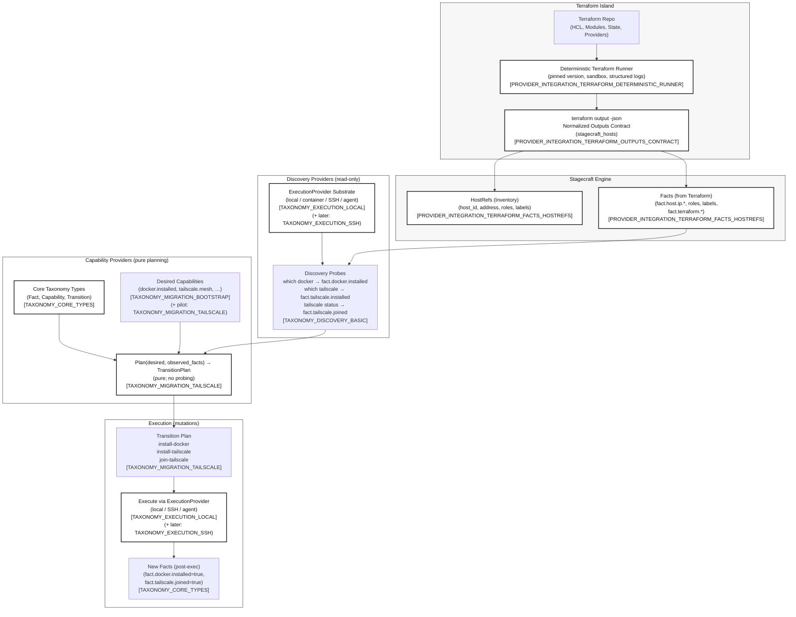

# Terraform Island

## Terraform is not the problem

Terraform is excellent at provisioning infrastructure.
Stagecraft is not trying to replace it.

Terraform answers:
- What infrastructure should exist?
- How do I reconcile cloud APIs with desired state?

Stagecraft answers a different question:
- How do I *use* infrastructure once it exists?

These are complementary concerns.

## The Resource Trap (briefly)

Terraform operates on **resources**.
Stagecraft operates on **capabilities and transitions**.

Trying to ingest Terraform’s resource graph into Stagecraft would reintroduce the very problems we are explicitly fixing:
- Planning that depends on live API calls
- Execution mixed into reasoning
- Flaky, non-reproducible plans

So Stagecraft does not interpret Terraform resources.

## The Terraform Island model

Stagecraft treats Terraform as an **island**:

- Terraform runs deterministically in an execution sandbox
- Terraform provisions infrastructure and manages its own state
- Stagecraft reads only **Terraform outputs**
- Those outputs are normalized into:
  - **HostRefs** (engine-owned host inventory)
  - **Facts** (immutable observations)

Terraform owns provisioning.
Stagecraft owns orchestration.

## The one contract

There is exactly one required contract between Terraform and Stagecraft:

```text
terraform output -json
└── output "stagecraft_hosts"
```

```hcl
Below is a clean, copy-pasteable diagram you can use in docs. It’s deliberately conceptual, not implementation-noisy, and matches your taxonomy (Discovery, Planning, Execution separation).

You can drop this into:
	•	docs/narrative/terraform-island.md
	•	or docs/architecture/ as a reference diagram

⸻

Terraform Island → Capabilities → Execution (Conceptual Flow)

┌────────────────────────────────────────────────────────────┐
│                    Terraform Island                         │
│                                                            │
│   Terraform Repo                                            │
│   (HCL, Modules, State, Providers)                          │
│                                                            │
│   ┌────────────────────────────────────────────────────┐   │
│   │ ExecutionProvider                                   │   │
│   │ (local / container / agent)                         │   │
│   │                                                    │   │
│   │   terraform init                                   │   │
│   │   terraform workspace select|new                   │   │
│   │   terraform apply                                  │   │
│   │   terraform output -json                           │   │
│   │                                                    │   │
│   └────────────────────────────────────────────────────┘   │
│                                                            │
│                Normalized Outputs                           │
│         (Stagecraft-owned JSON contract)                    │
│                                                            │
│   stagecraft_hosts[]                                        │
│   └─ host_id, ips, roles, labels                            │
│                                                            │
└───────────────┬────────────────────────────────────────────┘
                │
                │ emits
                ▼
┌────────────────────────────────────────────────────────────┐
│                 Stagecraft Engine                            │
│                                                            │
│   HostRefs (Inventory)                                      │
│   ───────────────────                                      │
│   prod-web-1, prod-worker-1, …                              │
│                                                            │
│   Facts (Observed State)                                    │
│   ─────────────────────                                    │
│   fact.host.ip.public                                       │
│   fact.host.roles                                           │
│   fact.terraform.workspace                                  │
│                                                            │
└───────────────┬────────────────────────────────────────────┘
                │
                │ discovery (read-only)
                ▼
┌────────────────────────────────────────────────────────────┐
│              Discovery Providers                             │
│                                                            │
│   SSH / Agent / Local Execution                             │
│                                                            │
│   which docker        → fact.docker.installed               │
│   which tailscale     → fact.tailscale.installed            │
│   tailscale status    → fact.tailscale.joined               │
│                                                            │
│   (No mutations allowed here)                               │
│                                                            │
└───────────────┬────────────────────────────────────────────┘
                │
                │ pure function
                ▼
┌────────────────────────────────────────────────────────────┐
│              Capability Providers (Planning)                 │
│                                                            │
│   Inputs:                                                   │
│     - Desired Capabilities                                  │
│     - Observed Facts                                        │
│                                                            │
│   Output:                                                   │
│     Transition Plan                                         │
│                                                            │
│   Example:                                                  │
│     IF docker.installed == false                            │
│        → install-docker                                     │
│     IF tailscale.joined == false                            │
│        → join-tailscale                                     │
│                                                            │
│   (No execution, no probing)                                │
│                                                            │
└───────────────┬────────────────────────────────────────────┘
                │
                │ orchestrated execution
                ▼
┌────────────────────────────────────────────────────────────┐
│              Execution Providers (The Hands)                 │
│                                                            │
│   Local Exec / SSH / Agent                                  │
│                                                            │
│   install-docker                                            │
│   install-tailscale                                         │
│   tailscale up --auth-key=…                                 │
│                                                            │
│   Structured results → new Facts                            │
│                                                            │
└────────────────────────────────────────────────────────────┘
```

⸻

How to read this diagram (key points)

1. Terraform is execution-only

Terraform never participates in planning.
Stagecraft never interprets Terraform’s resource graph.

The boundary is terraform output -json.

⸻

2. Facts are the currency

Everything past Terraform is driven by Facts:
	•	Terraform emits facts about existence and reachability
	•	Discovery emits facts about actual host state
	•	Planning consumes facts, never APIs or shells

This is what fixes determinism.

⸻

3. Capabilities are intent, not infrastructure

Capabilities answer:

“What should this host be capable of?”

Not:

“What resource should exist?”

That’s why Docker install, Tailscale join, agent enrollment all fit cleanly.

⸻

4. Execution is swappable

The bottom box is intentionally generic:
	•	Today: SSH
	•	Tomorrow: systemd agent
	•	In CI: container runner

Same plan, same facts, different hands.

⸻

Optional caption you can add under the diagram

Terraform provisions. Stagecraft reasons. Execution mutates.
Each phase has a single responsibility, and no phase is allowed to cheat.

If you want next, I can:
	•	convert this into a Mermaid diagram for rendered docs,
	•	align it visually with your existing architecture diagrams,
	•	or annotate it with feature IDs so it directly maps to your implementation roadmap.



Notes on alignment and roadmap mapping:
	•	Boxes and grouping mirror your architecture narrative: External island → Engine ingest → Discovery → Pure planning → Execution.
	•	Feature IDs are placed directly on the nodes they implement so this diagram can be used as a roadmap index.
	•	The diagram assumes you’ll add the taxonomy feature IDs you already referenced in your refactor blueprint:
	•	TAXONOMY_CORE_TYPES
	•	TAXONOMY_EXECUTION_LOCAL
	•	TAXONOMY_DISCOVERY_BASIC
	•	TAXONOMY_MIGRATION_TAILSCALE
	•	TAXONOMY_MIGRATION_BOOTSTRAP
	•	and (later) TAXONOMY_EXECUTION_SSH

If you want this to render exactly like your other diagrams, tell me what Mermaid theme settings you’re using (or paste one existing Mermaid block from your docs) and I’ll match the style precisely.
```
